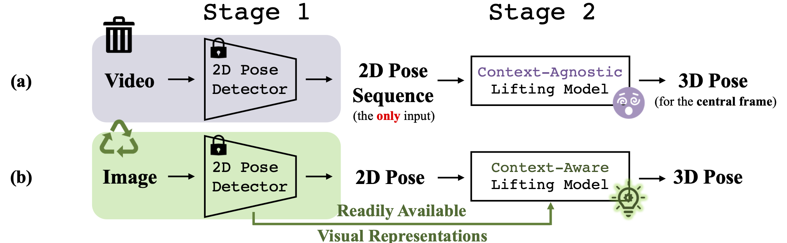

# ContextAware-PoseFormer

This repo is the official implementation for **A Single 2D Pose with Context is Worth Hundreds for 3D Human Pose Estimation**. The paper has been accepted to [NeurIPS 2023](https://nips.cc/).

[arXiv](https://arxiv.org/pdf/2311.03312.pdf) / [project page](https://qitaozhao.github.io/ContextAware-PoseFormer) / [video](https://recorder-v3.slideslive.com/#/share?share=87185&s=6df19fee-f7ae-4be9-af4e-3a89fd626400)

### News

[2024.07.25] We updated the code for [MPI-INF-3DHP](https://github.com/QitaoZhao/ContextAware-PoseFormer/tree/main/ContextPose_mpi) (sorry about the delay) and added support for multiple feature backbones (HRNet-48 & CPN).
[2023.12.23] The pre-processed labels for Human3.6M are available [here](https://drive.google.com/drive/folders/1OYKWnu_5GPLRfceD3Psf4-JZkloBodKx). We also added [video narration](https://recorder-v3.slideslive.com/#/share?share=87185&s=6df19fee-f7ae-4be9-af4e-3a89fd626400) for our paper.
[2023.11.06] Our paper on [arXiv](https://arxiv.org/pdf/2311.03312.pdf) has been released. We are preparing for the video narration; some parts of the code still need cleaning. 

## Related Previous Work

+ PoseFormer: https://arxiv.org/abs/2103.10455
+ PoseFormerV2: https://arxiv.org/abs/2303.17472

## Introduction

**Abstract.** The dominant paradigm in 3D human pose estimation that lifts a 2D pose sequence to 3D heavily relies on long-term temporal clues (i.e., using a daunting number of video frames) for improved accuracy, which incurs performance saturation, intractable computation and the non-causal problem. This can be attributed to their inherent inability to perceive spatial context as plain 2D joint coordinates carry no visual cues. To address this issue, we propose a straightforward yet powerful solution: leveraging the *readily available* intermediate visual representations produced by off-the-shelf (pre-trained) 2D pose detectors -- no finetuning on the 3D task is even needed. The key observation is that, while the pose detector learns to localize 2D joints, such representations (e.g., feature maps) implicitly encode the joint-centric spatial context thanks to the regional operations in backbone networks. We design a simple baseline named **Context-Aware PoseFormer** to showcase its effectiveness. *Without access to any temporal information*, the proposed method significantly outperforms its context-agnostic counterpart, PoseFormer, and other state-of-the-art methods using up to *hundreds of* video frames regarding both speed and precision. 



**Framework.** A comparison between previous methods (a) and our method (b) at a framework level. Previous methods discard the learned representations produced by 2D pose detectors and heavily rely on long-term temporal information. We retrieve such visual representations and engage them in the lifting process. We selectively extract joint-context features from feature maps, enabling our single-frame model to outperform video-based models with extremely large frame numbers. Note that we do not fine-tune the feature maps on the 3D task.

## Environment

The code is developed and tested under the following environment.

- Python 3.8.10
- PyTorch 1.11.0
- CUDA 11.3

````
cd ContextPose
conda create --name conposeformer --file conda-requirements.txt
conda activate conposeformer
pip install -r requirements.txt
````

## Human3.6M

### Dataset Preparation

1. Please refer to [H36M-Toolbox](https://github.com/CHUNYUWANG/H36M-Toolbox) to set up RGB images from the Human3.6M dataset. We include this repo in our project for your convenience. All RGB images should be put under `code_root/H36M-Toolbox/images/`. 

    **Note**: Only RGB images take around 200GB of disk space, while intermediate files take even more space. Carefully remove these intermediate files after each step if you do not have sufficient disk space.

2. Download `data_2d_h36m_cpn_ft_h36m_dbb.npz` from [VideoPose3D](https://github.com/facebookresearch/VideoPose3D/blob/main/DATASETS.md) and put it under `code_root/H36M-Toolbox/data/`. This file contains pre-processed CPN-detected keypoints.

3. We modify `generate_labels_h36m.py` from `generate_labels.py` provided by [H36M-Toolbox](https://github.com/CHUNYUWANG/H36M-Toolbox). Run `generate_labels_h36m.py` to generate labels (`h36m_train.pkl` and `h36m_validation.pkl`) for training and testing. It may take a while.

4. **Pre-processed data**: please check [here](https://drive.google.com/drive/folders/1OYKWnu_5GPLRfceD3Psf4-JZkloBodKx) for the pre-processed labels if you don't want to generate them yourself, but note that you still need to download the images from the dataset following the first step.

5. Your directory should look like this if you correctly follow the previous steps.

```
code_root/ 
├── README.md
├── ContextPose/
└── H36M-Toolbox/
    ├── ...
    ├── generate_labels_h36m.py
    ├── h36m_train.pkl
    ├── h36m_validation.pkl
    ├── data/
    	└── data_2d_h36m_cpn_ft_h36m_dbb.npz
    └── images/
        ├── s_01_act_02_subact_01_ca_01/
            ├── s_01_act_02_subact_01_ca_01_000001.jpg
            ├── ...
            └── s_01_act_02_subact_01_ca_01_001384.jpg
        ├── s_01_act_02_subact_01_ca_02/
        ├── ...
        └── s_11_act_16_subact_02_ca_04/
```

### Train

It's time to train your model! Our framework supports multiple 2D joint feature backbones.

1. Move `h36m_train.pkl` and `h36m_validation.pkl` from `code_root/H36M-Toolbox/` to `code_root/ContextPose/data/`
2. Download (COCO) pretrained weights for [HRNet-32/48](https://drive.google.com/drive/folders/1nzM_OBV9LbAEA7HClC0chEyf_7ECDXYA) or [CPN](https://drive.google.com/file/d/1pUpU8o6QtgK197vAfCtT5cxokE9p-yuB/view) and place them under `code_root/ContextPose/data/pretrained/coco/`
3. Your directory should look like this if you completed the previous steps.

```
code_root/ 
├── README.md
├── H36M-Toolbox/
└── ContextPose/
    ├── ...
    ├── train.py
    ├── experiments/
    ├── data/
    	├── h36m_train.pkl
    	├── h36m_validation.pkl
    	└── pretrained/
    		└── coco/
    			├── README.MD
    			├── CPN50_256x192.pth.tar
    			├── pose_hrnet_w32_256x192.pth
    			└── pose_hrnet_w48_256x192.pth
    └── mvn/
```

You can train **Context-Aware PoseFormer** with the following commands:

```bash
# Single GPU (we used a single 3090 to report our numbers, which is the default setting)
CUDA_VISIBLE_DEVICES=0 python -m torch.distributed.launch --nproc_per_node=1 --master_port=2345 train.py --config experiments/human36m/human36m.yaml --backbone hrnet_32 --logdir ./logs

# Multiple GPUs (e.g., 4, you might change LR a bit to get better results)
CUDA_VISIBLE_DEVICES=0,1,2,3 python -m torch.distributed.launch --nproc_per_node=4 --master_port=2345 train.py --config experiments/human36m/human36m.yaml --backbone hrnet_32 --logdir ./logs
```

Available choices for `--backbone` are `['cpn', 'hrnet_32', 'hrnet_48']`.

### Test

We include the checkpoint for each backbone [here](https://drive.google.com/drive/u/1/folders/1O_i3OUTnqlkLWFu_3WKPU7YepWhItd59). Place the pre-trained model weights (`best_epoch_{BACKBONE_NAME}.bin`) under `code_root/ContextPose/checkpoint/`, and run:

```bash
# Single GPU (this may take a while to complete)
CUDA_VISIBLE_DEVICES=0 python -m torch.distributed.launch --nproc_per_node=1 --master_port=2345 train.py --config experiments/human36m/human36m.yaml --backbone hrnet_32 --logdir ./logs --eval

# Multiple GPUs (e.g., 4, this should be much faster)
CUDA_VISIBLE_DEVICES=0,1,2,3 python -m torch.distributed.launch --nproc_per_node=4 --master_port=2345 train.py --config experiments/human36m/human36m.yaml --backbone hrnet_32 --logdir ./logs --eval
```

## MPI-INF-3DHP

We followed [P-STMO](https://github.com/paTRICK-swk/P-STMO?tab=readme-ov-file#mpi-inf-3dhp-1) to prepare the data and train our model. Please click [here](https://github.com/QitaoZhao/ContextAware-PoseFormer/tree/main/ContextPose_mpi) for details.

## Cite Our Work

If you find our work useful in your research, please consider citing:

```bibtex
@inproceedings{
    zhao2023contextaware,
    title={A Single 2D Pose with Context is Worth Hundreds for 3D Human Pose Estimation},
    author={Zhao, Qitao and Zheng, Ce and Liu, Mengyuan and Chen, Chen},
    booktitle={Thirty-seventh Conference on Neural Information Processing Systems},
    year={2023},
}
```

## Acknowledgment

Our codes are primarily based on [ContextPose](https://github.com/ShirleyMaxx/ContextPose-PyTorch-release) and [PoseFormer](https://github.com/zczcwh/PoseFormer). We followed [H36M-Toolbox](https://github.com/CHUNYUWANG/H36M-Toolbox) to prepare the Human3.6M dataset and [P-STMO](https://github.com/paTRICK-swk/P-STMO?tab=readme-ov-file#mpi-inf-3dhp-1) for MPI-INF-3DHP. Many thanks to the authors!

